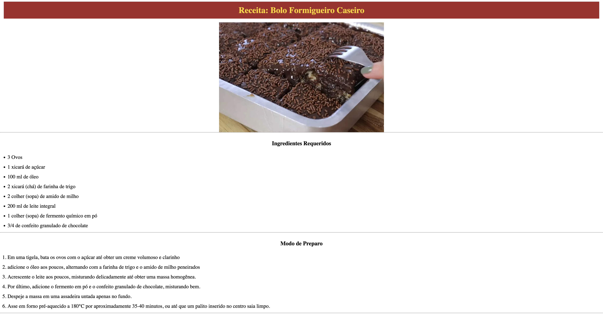

# Receita-de-Bolo
] 

Aula usando o codepen realizando o uso de HTML, CSS e realizando a atividade sobre uma receita.

## Tecnologias
* Html
* Css
* Git
* GitHub

## Autor
[Guilherme Viana de Souza]()